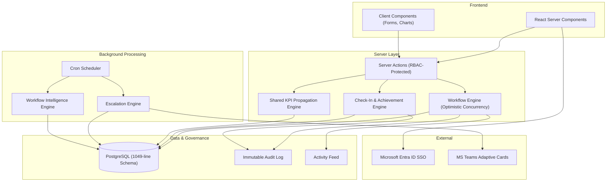

# ATOMQUEST | Enterprise Goal Intelligence Platform

<div align="center">
  <h3>Enterprise-grade organizational alignment powered by intelligent performance engineering.</h3>
  <p>Engineered for massive-scale organizational structures, deep operational observability, and resilient goal orchestration.</p>
</div>

---

## Executive Summary

ATOMQUEST is a cloud-native, next-generation Enterprise Goal Intelligence System. Moving beyond simple OKR tracking, ATOMQUEST operates as an **operational intelligence platform**, actively monitoring goal health, identifying organizational bottlenecks, orchestrating complex approval workflows, propagating shared KPIs, and tracking quarterly achievement with deterministic scoring engines.

Built on a transactionally-safe Next.js 15 + PostgreSQL architecture with Microsoft Entra ID SSO, it resembles the engineering quality, scalability, and UX finish of tier-1 SaaS systems.

## Technology Stack

| Layer | Technology |
|---|---|
| Frontend | Next.js 15 (App Router), React 19, React Server Components |
| Styling | Tailwind CSS 4, Framer Motion, Recharts |
| Backend | Next.js Server Actions, Prisma ORM 6, PostgreSQL |
| Authentication | NextAuth.js v5, Microsoft Entra ID SSO |
| Validation | Zod, React Hook Form |
| Infrastructure | Vercel (Edge), PgBouncer, Structured Logging |

## Architecture



## Core Capabilities

### Phase 1 -- Goal Creation & Approval

- **Goal Drafting:** Employees create weighted KPI goals with configurable scoring methods (Numeric Min/Max, Percentage, Timeline, Zero-Based).
- **Allocation Policy Enforcement:** Real-time validation ensures total weightage = 100%, max 8 goals per plan, and no duplicate KPI assignments.
- **Governance Windows:** Time-boxed submission periods prevent late modifications and enforce quarterly discipline.
- **Manager Approval Workflow:** Structured approve/return-for-rework flow with optimistic concurrency via version columns.
- **Shared KPI Propagation:** Master KPI definitions cascade targets down organizational hierarchies with version-tracked sync logging.

### Phase 2 -- Achievement Tracking & Quarterly Check-ins

- **Deterministic Scoring Engine:** UoM-based achievement computation supporting 4 formula types with score clamping at 200%.
- **Employee Check-In Workspace:** Quarterly submission interface with draft saving, actual vs planned comparison, and progress status management.
- **Manager Review Dashboard:** Subordinate check-in review with inline achievement correction, structured feedback, and approval/return workflows.
- **Goal Progress Synchronization:** Approved check-ins automatically update master goal tracking tables.

### Phase 3 -- Analytics & Enterprise Operations

- **Executive Dashboard:** Organization-wide KPI health, workflow pipeline analysis, QoQ trend charts, and departmental benchmarks.
- **Escalation Engine:** Policy-driven alerts that route from Manager (14 days) to HR (21 days) to Admin (28+ days) with idempotent deduplication.
- **Microsoft Teams Integration:** Adaptive Card payload generation for actionable approval workflows directly in Teams.
- **CSV Export:** Hierarchy-aware achievement report export with Excel-ready formatting.
- **Immutable Audit Trail:** SOX-compliance-ready audit logging with `txid_current()` transaction tracking and auto-incrementing sequence numbers.

## Role-Based Access

| Role | Capabilities | Demo Route |
|---|---|---|
| **Admin** | Executive dashboard, KPI governance, org-wide analytics, audit visibility | `/admin`, `/dashboard` |
| **Manager** | Goal plan approvals, check-in reviews, team analytics, escalation visibility | `/manager`, `/manager/checkins` |
| **Employee** | Goal drafting, quarterly check-ins, personal KPI tracking | `/employee`, `/employee/checkins` |

## Demo Credentials

After running the seed script, the following users are available:

| Role | Email | Name | Department |
|---|---|---|---|
| Admin | `admin@acme.corp` | Eleanor Vance | Executive |
| Manager | `mgr.eng@acme.corp` | Marcus Chen | Engineering |
| Manager | `mgr.sales@acme.corp` | Priya Sharma | Sales |
| Employee | `dev1@acme.corp` | Aisha Rahman | Engineering |
| Employee | `dev2@acme.corp` | James Okonkwo | Engineering |
| Employee | `sales1@acme.corp` | Sophie Dubois | Sales |
| Employee | `ops1@acme.corp` | Kenji Tanaka | Operations |
| Employee | `sales2@acme.corp` | Lucas Martinez | Sales |

## Getting Started

### Prerequisites

- Node.js 20+
- PostgreSQL 15+
- Microsoft Entra ID application registration (for SSO)

### Environment Setup

```bash
cp .env.example .env
```

Required environment variables:

| Variable | Description |
|---|---|
| `DATABASE_URL` | PostgreSQL connection string |
| `AUTH_SECRET` | NextAuth session signing secret |
| `AUTH_URL` | Application base URL |
| `AUTH_MICROSOFT_ENTRA_ID_ID` | Entra ID application (client) ID |
| `AUTH_MICROSOFT_ENTRA_ID_SECRET` | Entra ID client secret |
| `AUTH_MICROSOFT_ENTRA_ID_ISSUER` | Entra ID issuer URL with tenant ID |
| `AUTH_ALLOWED_TENANT_IDS` | Comma-separated allowed tenant IDs |

### Local Development

```bash
npm install
npx prisma generate
npx prisma migrate dev
npx tsx prisma/seed.ts
npm run dev
```

### Production Build

```bash
npm run build
npm start
```

## Project Structure

```
atomquest/
  app/                    # Next.js App Router pages
    admin/                # Admin KPI governance control plane
    dashboard/            # Executive analytics dashboard
    employee/             # Employee goal workspace + check-ins
    manager/              # Manager approval center + check-in reviews
    api/                  # API routes (cron, webhooks, reports)
  src/
    components/           # React components (goals, checkins, analytics, ui)
    lib/
      checkins/           # Scoring engine, validation schemas
      goals/              # Business rules, governance calendar, types
      security/           # RBAC, permissions, hierarchy, session, audit
    server/
      analytics/          # Executive dashboard queries (1400+ lines)
      checkins/           # Check-in workflow engine + server actions
      goals/              # Goal workflow engine + KPI propagation
      escalations/        # Policy-driven escalation engine
      governance/         # Audit + activity feed services
      cron/               # Scheduled background processing
  prisma/
    schema.prisma         # 1049-line enterprise data model (24+ models)
    seed.ts               # Enterprise demo data seeding
  scripts/                # Windows automation (.bat)
```

## Security Posture

- **Authentication:** Microsoft Entra ID SSO with tenant-level isolation and JWT claim hydration.
- **Authorization:** Hierarchical RBAC with `assertCanManageUser` recursive tree verification.
- **Audit:** Immutable, transactional audit logs with `txid_current()` correlation.
- **Transport:** HSTS, CSP, X-Frame-Options: DENY, X-Content-Type-Options: nosniff.
- **Server Actions:** All mutations wrapped in `createProtectedAction` with permission enforcement.

## Scalability Design

- **Optimistic Concurrency:** Version columns prevent data races across concurrent approvals.
- **Keyset Pagination:** Cursor-based pagination for audit logs and activity feeds.
- **Compound Indexes:** Targeted indexes on high-cardinality query paths.
- **Bundle Optimization:** `optimizePackageImports` for lucide-react, recharts, framer-motion.
- **Streaming UI:** React Suspense boundaries with `loading.tsx` shell rendering.

---

*ATOMQUEST -- Redefining enterprise execution at scale.*
